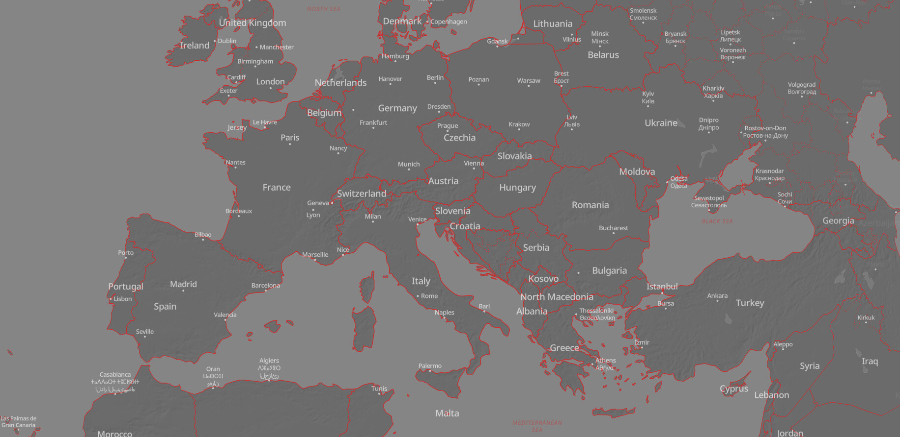

<p align="center">
  </img>
</p>
<p align="center">
Basemaps for the people!</a>
</p>
<p align="center">
Compatible with <a href="https://maplibre.org/maplibre-gl-js/docs/">Maplibre GL JS</a> + <a href="https://protomaps.com/">Protomaps</a>
</p>

<p align="center">
  </img>
</p>

**Basemapkit** generates customizable styles compatible with **Maplibre GL JS** that relies on the **Protomaps** Planet schemas when it comes to [vector layers and feature properties](https://docs.protomaps.com/basemaps/layers). You can download your own PMtiles copy of the planet on the official [Protomaps build page](https://maps.protomaps.com/builds/).


| |  |  |
| :----------------: | :------: | ----: |
|  |  |  |
|  | |  |
|  |  |  |
|  |  |  |
|  |  |  |
|  |  |  |
|  |  |  |


## Getting started 👷
### Install
On an existing ES project:
```bash
npm install basemapkit
```

### Add some style
The following example instantiates a Maplibre `Map`, then initializes the Protomaps protocol and then generates a style with Basemapkit:

```ts
import "maplibre-gl/dist/maplibre-gl.css";

import maplibregl from "maplibre-gl";
import { Protocol } from "pmtiles";
import { getStyle, getStyleList } from "basemapkit";

// Adds the Protomaps protocol:
maplibregl.addProtocol("pmtiles", new Protocol().tile);

// Build the Basemapkit style
const style = getStyle(
  // One of the main syle:
  "avenue", 
  {
    // URL to the pmtiles
    pmtiles: "https://my-s3-bucket.com/planet.pmtiles",

    // URL to the sprites (for POIs)
    sprite: "https://raw.githubusercontent.com/jonathanlurie/phosphor-mlgl-sprite/refs/heads/main/sprite/phosphor-diecut",

    // URL to the glyphs (for labels)
    glyphs: "https://protomaps.github.io/basemaps-assets/fonts/{fontstack}/{range}.pbf";

    // Language (you can ommit to use the platform language)
    lang: "en",
  });

// Instantiate the Map:
const map = new maplibregl.Map({
  container: "map",
  center: [0, 0],
  zoom: 3,
  
  // Add the Basemapkit style:
  style,
});
```

If using a traditional `tile.json` and `z/x/y` tiles instead of http-range-requesting a `pmtiles` file, then replace the option `pmtiles` by `tilejson`, as in the example below:

```ts
const style = getStyle(
// One of the main syle:
"avenue", 
{
  // URL to the tile.json
  tilejson: "https://example.com/tile.json",

  // URL to the sprites (for POIs)
  sprite: "https://raw.githubusercontent.com/jonathanlurie/phosphor-mlgl-sprite/refs/heads/main/sprite/phosphor-diecut",

  // URL to the glyphs (for labels)
  glyphs: "https://protomaps.github.io/basemaps-assets/fonts/{fontstack}/{range}.pbf";

  // Language (you can ommit to use the platform language)
  lang: "en",
});
```
This can get particularly handy when using the [Protomaps CLI](https://docs.protomaps.com/pmtiles/cli) or [Martin](https://martin.maplibre.org/) to serve `z/x/y` vector tiles.

## Language 📣
Basemakit styles are compatible with Protomaps languages properties and uses [`@protomaps/basemaps`](https://docs.protomaps.com/basemaps/flavors) under the hood. 

The only addition from **Basemapkit** is the capability to detect the end user's platform language, so if the `lang` option is omitted, it will automatically use the language set by the user at the browser or OS level.

Here is the list of supported languages:
```ts
"ar" | "cs" | "bg" | "da" | "de" | "el" | "en" | "es" | "et" | "fa" | "fi" | "fr" | "ga" | "he" | "hi" | "hr" | "hu" | "id" | "it" | "ja" | "ko" | "lt" | "lv" | "ne" | "nl" | "no" | "mr" | "mt" | "pl" | "pt" | "ro" | "ru" | "sk" | "sl" | "sv" | "tr" | "uk" | "ur" | "vi" | "zh-Hans" | "zh-Hant"
```

## Terrain 🏔️
Basemapkit can feature hillshading and/or terrain bumps when a terrain tileset is provided. The terrain tiles can be encoded as `"mapbox"` (default) or `"terrarium"`, in either PNG or WebP format. Then, the terrain tileset can be packed as *pmtiles* (``options.terrain.pmtiles`) or left as individual tiles, using a *tiles.json* as entry point (`options.terrain.tilejson`).  

| |  |  | |  |
| :----------------: | :------: | :----: | :------: | :----: |
|  |  |  |  |  |


Here is how to add hillshading but keep the terrain flat. Those settings are actually the default when the terrain tiles are provided.

```ts
const style = getStyle(
"avenue", 
{
  pmtiles: "",
  sprite: "...",
  glyphs: "...";
  lang: "...",

  /**
   * The terrain options:
   */
  terrain: {
    /**
     * The public URL of a pmtiles files for raster terrain, encoded on RGB channels of either PNG or WebP. To use if sourcing tiles directly with
     * range-request using the `pmtiles`'s protocol. Alternatively, the option `tileJson` can be used and will take precedence.
     */
    pmtiles: "https://my-s3-bucket.com/terrain.pmtiles";

    /**
     * Enable or disable the hillshading. Enabled by default if one of the source options `terrain.pmtiles` or `terrain.tilejson` is provided.
     * It cannot be enabled if none of the source option is provided.
     */
    hillshading: true,

    /**
     * The terrain exaggeration is disabled by default, making the terrain flat even if one of the source options `terrain.pmtiles` or `terrain.tilejson` is provided.
     * A value of `1` produces at-scale realistic terrain elevation.
     * It cannot be enabled if none of the source option is provided.
     */
    exaggeration: 0,

    /**
     * Encoding of the terrain raster data. Can be "mapbox" or "terrarium". Default: "mapbox"
     */
    encoding: "mapbox",
  }
});
```

Alternatively, if the terrain tiles are refered to with a `tiles.json`:

```ts
const style = getStyle(
"avenue", 
{
  pmtiles: "",
  sprite: "...",
  glyphs: "...";
  lang: "...",

  /**
   * The terrain options:
   */
  terrain: {
    /**
     * The public URL to a tile JSON file for raster terrain tiles, encoded on RGB channels of either PNG or WebP. To use if classic z/x/y MVT tiles are served through
     * Maplibre's Martin or the pmtiles CLI. Will take precedence on the option `pmtiles` if both are provided.
     */
    tilejson: "https://example.com/terrain-tile.json";
  }
});
```

## POIs and labels 📍
There are options to hide the points of interests and labels. By default, both are shown, meaning the options goes like this:
```ts
getStyle(
  "avenue", 
  {
    pmtiles: "...",
    sprite: "...",
    glyphs: "...",

    hidePOIs: false,
    hideLabels: false,
  });
```
So by default, London looks like this:


But POIs can be hidden by doing this:
```ts
getStyle(
  "avenue", 
  {
    pmtiles: "...",
    sprite: "...",
    glyphs: "...",

    hidePOIs: true,
    hideLabels: false,
  });
```
Then the same locations looks like this:


Alternatively, the labels can be hidden, this includes POIs' labels, so only POIs' icons will be shown by doing this:
```ts
getStyle(
  "avenue", 
  {
    pmtiles: "...",
    sprite: "...",
    glyphs: "...",

    hidePOIs: false,
    hideLabels: true,
  });
```
here is how it looks like:


And finally, both labels and POIs can be hidden, resulting in a somewhat mysterious map:
```ts
getStyle(
  "avenue", 
  {
    pmtiles: "...",
    sprite: "...",
    glyphs: "...",

    hidePOIs: true,
    hideLabels: true,
  });
```


Note that the corresponding layers are removed from the style and not just made invisible. If hiding POIs or label, the options `sprite` and `glyph` are unnecessary.

## Globe or Mercator projection 🌐
By default, the styles available in basempkit are all showing Earth as a globe, but Mercator projection can still be used.  use
The option `globe` (boolean) can be set to `false` in the functions `getStyle()` and `buildStyle()`. Just like that:

```ts
getStyle(
  "avenue", 
  {
    pmtiles: "...",
    sprite: "...",
    glyphs: "...",
    globe: false,
  });
```

## Getting creative with `buildStyle()` 🎨
In addition to language and hiding POIs/labels, Basmapkit exposes some methods to modify the colors of the original style (`avenue`) to create *presets*. When the style is generated with some non-default `colorEdit`, a brand new Maplibre style is created and can be directly injected into a Maplibre `Map` instance's `.setStyle()` method, or even written as a static json file.

```ts

buildStyle({
    pmtiles: "...",
    sprite: "...",
    glyphs: "...",
    terrain: {...},
    hidePOIs: false,
    hideLabels: false,
  
    // At the moment, "avenue" is the only style to start from
    baseStyleName: "avenue",

    colorEdit: {
      // Invert the colors:
      negate: false,

      // In the range [-1, 1]:
      brightness: 0,

      // In the range [-1, 1]:
      brightnessShift: 0,

      // In the range [-1, 1]:
      exposure: 0,

      contrast: [
        // intensity in the range [-1, 1]:
        0,
        // Midpoint in [0, 255]
        127
      ],

      // Rotate around the hue wheel, in range [0, 360]
      hueRotation: 0,

      // In the range [-1, 1] 
      // with -1 being gray levels and 1 being extra boosted colors
      saturation: 0,

      // Color blending with a multiply method
      multiplyColor: [
        // Color to multiply with
        "#ff0000",

        // blending factor in [0, 1]
        // with 0 being the original color and 1 being the the color above
        0
      ],

      // Linear color blending
      mixColor: [
        // Color to blend with
        "#ff0000",

        // blending factor in [0, 1]
        // with 0 being the original color and 1 being the the color above
        0
      ]
    }

  }
);
```
For instance, let's create a TMNT toxic N.Y.C. kind of map:
```json
{
  "baseStyleName": "avenue",
  "lang": "en",
  "hidePOIs": true,
  "hideLabels": false,
  "colorEdit": {
    "negate": true,
    "brightness": 0.4,
    "brightnessShift": 0,
    "exposure": 0.8,
    "contrast": [
      0.4,
      160
    ],
    "hueRotation": 80,
    "saturation": 0.12,
    "multiplyColor": [
      "#ff00ff",
      0.6
    ],
    "mixColor": [
      "#00ff00",
      0.3
    ]
  }
}
```
And here is the result:


You can live play with these on [basemapkit.jnth.io](https://s.jnth.io/s/basemapkit) and selecting the style `🖌️ custom 🎨`.  
And from this "color editor" were created the built-in styles available below...

## Available styles 📚
So far, we mentioned only the **Avenue** style as it's the first and default one, but there are many others! And while **Avenue** takes pride in being a rich yet generalistic style, Basemapkit provides styles that are better suited for **data visualization**, that are minimalistic and leaves room to your own data. And all the styles come with extra *presets*, meaning variants, playing with color and contrasts, but more on this in the next section.  

### Base style: `avenue`
**Avenue** is the default style, rich and with a focus on rendering somewhat natural colors:
```ts
// Create the style
const style = getStyle("avenue", options);
```
[DEMO 🌍](https://basemapkit.jnth.io/?styleid=avenue)


**Here are the available presets:**
- `avenue-pop`  


- `avenue-night`  


- `avenue-bright`  


- `avenue-saturated`  


- `avenue-warm`  


- `avenue-vintage`  


- `avenue-bnw`  


- `avenue-blueprint`  


### Base style: `bureau`
**Bureau** is your dataviz companion! it has minimal clutter, same hue, (yet different shade) for land and water, the point is not to be realistic but to be a backdrop just present enough to give context.
```ts
// Create the style
const style = getStyle("bureau", options);
```
[DEMO 🌍](https://basemapkit.jnth.io/?styleid=bureau)


**Here are the available presets:**
- `bureau-negative`  


- `bureau-bnw`  


- `bureau-purple`  


- `bureau-bnw-negative`  


- `bureau-bnw-dark`  


- `bureau-bnw-bright`  


- `bureau-bnw-negative-bright`  


- `bureau-bnw-negative-dark`  


- `bureau-sand`  


- `bureau-sand-negative`  


- `bureau-ivory`  


- `bureau-ivory-negative`  


- `bureau-navy`  


### Base style: `journal`
**Journal** borrows from both **Avenue** and **Bureau**. It's great for dataviz while preserving a natural feel.
```ts
// Create the style
const style = getStyle("journal", options);
```
[DEMO 🌍](https://basemapkit.jnth.io/?styleid=journal)


**Here are the available presets:**
- `journal-night`  


- `journal-teal`  


- `journal-vintage`  


### Base style: `monochrome`
**Monochrome** is a very contrasty, yet with a soft and velvety touch. It's great with a bright and colorful overlay!
```ts
// Create the style
const style = getStyle("monochrome", options);
```
[DEMO 🌍](https://basemapkit.jnth.io/?styleid=monochrome)


(No extra preset, but you can still extend it and make your own with `buildStyle()`)


### Base style: `spectre`
At first, **Spectre** may look a bit weird and unconventional, but it's actually a solid friend for everything weather and climate! It has only the minimal, no road, no street label, no park, just extra bright boundaries.
```ts
// Create the style
const style = getStyle("spectre", options);
```
[DEMO 🌍](https://basemapkit.jnth.io/?styleid=spectre)


Spectre comes with many extra presets, mostly to change the hue of the coastline and boundaries, but also to swap which of the land or sea is darker. Here is the full list:

- `spectre-mild-green`  


- `spectre-red`  


- `spectre-blue`  


- `spectre-purple`  


- `spectre-pink`  


- `spectre-orange`  


- `spectre-yellow`  


- `spectre-negative`  


- `spectre-negative-mild-green`  


- `spectre-negative-red`  


- `spectre-negative-blue`  


- `spectre-negative-purple`  


- `spectre-negative-pink`  


- `spectre-negative-orange`  


- `spectre-negative-yellow`  


# Extra API 🪄
The extra API goes beyond just providing style, yet, it's still minimal and only related to "obtain a style as one need it".

## Swapping two layers
It does exactely what you think: swapping layers. But it does it in a non-destructive way. This can be quite handy when using `spectre` or `spectre-negative` if you prefer to have a dark/light overlay on top of either land or water area when you add your own data layer.

```ts
import { swapLayers, getStyle } from "basemapkit";

...
const myStyle = getStyle("spectre", options);

// In the "spectre" style, the layer "eart" is underneath the layer "water".
// Let's swap those two:
const mySwappedStyle = swapLayers("earth", "water", myStyle);
```

## Set layer opacity
While the opacity of a layer is addressable with `map.setPaintProperty(...)`, this can only be done after the layer is mounted (in a `style.load` or `load` event callback) and the one would have to know the `type` of layer, since the opacity property has a different name for each type.  

Basemapkit exposes the function `setLayerOpacity()`, which let you set the opacity of a layer *before* it is mounted, and it also resolves the opacity property name for you:

```ts
import { setLayerOpacity, getStyle } from "basemapkit";

...
const myStyle = getStyle("spectre", options);
const opaqueOceanStyle = setLayerOpacity("water", 1, myStyle);
```

You can also provide a style expression if you want the opacity to depend on zoom level or another property. For instance, to have the country labels to progressively appear between z3 and z4:
```ts
import { setLayerOpacity, getStyle } from "basemapkit";

...
const myStyle = getStyle("spectre", options);

style = setLayerOpacity("places_country", 
[
  "interpolate",
  ["exponential", 2],
  ["zoom"],
  3, 0,
  4, 1
],
style);
```

The function `setLayerOpacity()` create a deep clone and apply the modification on it so it does not alter the provided style.

# License
MIT.