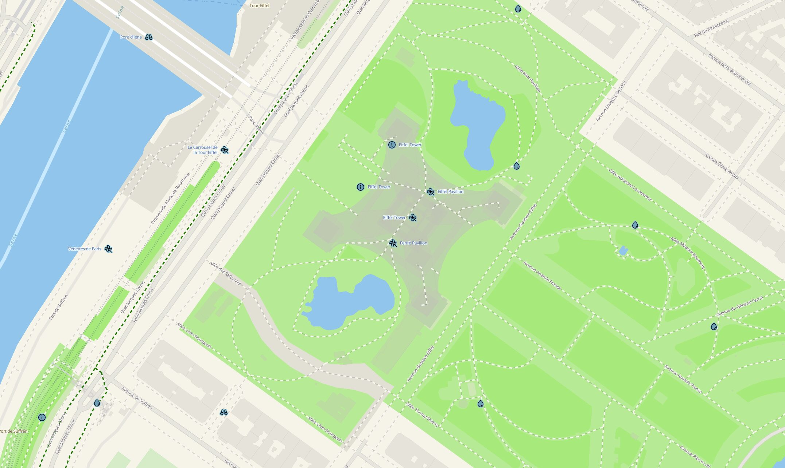

<p align="center">
  </img>
</p>
<p align="center">
Basemaps for <a href="https://maplibre.org/maplibre-gl-js/docs/">Maplibre GL JS</a> + <a href="https://protomaps.com/">Protomaps</a>
</p>

<p align="center">
  </img>
</p>

Basemapkit generates customizable styles compatible with **Maplibre GL JS** that relies on the **Protomaps** Planet schemas when it comes to [vector layers and feature properties](https://docs.protomaps.com/basemaps/layers). You can download your own PMtiles copy of the planet on the official [Protomaps build page](https://maps.protomaps.com/builds/). 


## Getting started
### Install
On an existing ES project:
```bash
npm install basemapkit
```

### Add some style
The following example add a Maplibre `Map`, add the Protomaps protocol and then generates a style:

```ts
import "maplibre-gl/dist/maplibre-gl.css";

import maplibregl from "maplibre-gl";
import { Protocol } from "pmtiles";
import { getStyle, getStyleList } from "basemapkit";

// Adds the Protomaps protocol:
maplibregl.addProtocol("pmtiles", new Protocol().tile);

// Build the Basemapkit style
const style = getStyle(
  // One of the main syle:
  "avenue", 
  {
    // URL to the pmtiles
    pmtiles: "https://my-s3-bucket.com/planet.pmtiles",

    // URL to the sprites (for POIs)
    sprite: "https://raw.githubusercontent.com/jonathanlurie/phosphor-mlgl-sprite/refs/heads/main/sprite/phosphor-diecut",

    // URL to the glyphs (for labels)
    glyphs: "https://protomaps.github.io/basemaps-assets/fonts/{fontstack}/{range}.pbf";

    // Language (you can ommit to use the platform language)
    lang: "en",
  });

// Instantiate the Map:
const map = new maplibregl.Map({
  container: "map",
  center: [0, 0],
  zoom: 3,
  
  // Add the Basemapkit style:
  style,
});
```

## Language
Basemakit styles are compatible with Protomaps languages properties and under the hood even uses [`@protomaps/basemaps`](https://docs.protomaps.com/basemaps/flavors). 

The only addition from **Basemapkit** is the capability to detect the end user's platform language, so if the `lang` option is omitted, it will automatically use the language set by the user at the browser or OS level.

Here is the list of supported languages:
```ts
"ar" | "cs" | "bg" | "da" | "de" | "el" | "en" | "es" | "et" | "fa" | "fi" | "fr" | "ga" | "he" | "hi" | "hr" | "hu" | "id" | "it" | "ja" | "ko" | "lt" | "lv" | "ne" | "nl" | "no" | "mr" | "mt" | "pl" | "pt" | "ro" | "ru" | "sk" | "sl" | "sv" | "tr" | "uk" | "ur" | "vi" | "zh-Hans" | "zh-Hant"
```

## POIs and labels
There are options to hide the points of interests and labels. By default, both are shown, meaning the options goes like this:
```ts
getStyle(
  "avenue", 
  {
    pmtiles: "...",
    sprite: "...",
    glyphs: "...";

    hidePOIs: false,
    hideLabels: false,
  });
```
So by default, London looks like this:


But POIs can be hidden by doing this:
```ts
getStyle(
  "avenue", 
  {
    pmtiles: "...",
    sprite: "...",
    glyphs: "...";

    hidePOIs: true,
    hideLabels: false,
  });
```
Then the same locations looks like this:


Alternatively, the labels can be hidden, this also includes the labels that come with POIs, so only POIs' icons will be shown by doing this:
```ts
getStyle(
  "avenue", 
  {
    pmtiles: "...",
    sprite: "...",
    glyphs: "...";

    hidePOIs: false,
    hideLabels: true,
  });
```
here is how it looks like:


And finally, both labels and POIs can be hidden, resulting in a bit of a mysterious map:
```ts
getStyle(
  "avenue", 
  {
    pmtiles: "...",
    sprite: "...",
    glyphs: "...";

    hidePOIs: true,
    hideLabels: true,
  });
```


Note that the corresponding layers are removed from the style and not just made invisible. If hiding POIs or label, the options `sprite` and `glyph` are unnecessary.

## Getting creative
In addition to 

```ts

getStyle("avenue", 
  {
    pmtiles: "...",
    sprite: "...",
    glyphs: "...";
    hidePOIs: false,
    hideLabels: false,
  

    colorEdit: {
      // Invert the colors:
      negate: false,

      // In the range [-1, 1]:
      brightness: 0,

      // In the range [-1, 1]:
      brightnessShift: 0,

      // In the range [-1, 1]:
      exposure: 0,

      contrast: [
        // intensity in the range [-1, 1]:
        0,
        // Midpoint in [0, 255]
        127
      ],

      // Rotate around the hue wheel, in range [0, 360]
      hueRotation: 0,

      // In the range [-1, 1] 
      // with -1 being gray levels and 1 being extra boosted colors
      saturation: 0,

      // Color blending with a multiply method
      multiplyColor: [
        // Color to multiply with
        "#ff0000",

        // blending factor in [0, 1]
        // with 0 being the original color and 1 being the the color above
        0
      ],

      // Linear color blending
      mixColor: [
        // Color to blend with
        "#ff0000",

        // blending factor in [0, 1]
        // with 0 being the original color and 1 being the the color above
        0
      ]
    }

  }
);
```
You can live play with these on [basmapkit.jnth.io](https://basemapkit.jnth.io/) and selecting the style `🖌️ custom 🎨`.  

From this "color editor" were created the built-in styles available below...


## Style presets available
Some custom `colorEdit` recipes are already built in Basemapkit and can be accessed directly from the `getStyle()`function.
### `avenue` ⤵️
This one is the default, with all the `colorEdit` options set to default:
```ts
// Create the style
const style = getStyle("avenue", options);
```





### `avenue-pop` ⤵️
```ts
// Create the style
const style = getStyle("avenue-pop", options);
```


 
 
### `avenue-night` ⤵️
```ts
// Create the style
const style = getStyle("avenue-night", options);
```


 
### `avenue-bright` ⤵️
```ts
// Create the style
const style = getStyle("avenue-bright", options);
```


### `avenue-saturated` ⤵️
```ts
// Create the style
const style = getStyle("avenue-saturated", options);
```


### `avenue-warm` ⤵️
```ts
// Create the style
const style = getStyle("avenue-warm", options);
```


### `avenue-vintage` ⤵️
```ts
// Create the style
const style = getStyle("avenue-vintage", options);
```


 
### `avenue-bnw` ⤵️
```ts
// Create the style
const style = getStyle("avenue-bnw", options);
```


### `avenue-blueprint` ⤵️
```ts
// Create the style
const style = getStyle("avenue-blueprint", options);
```


